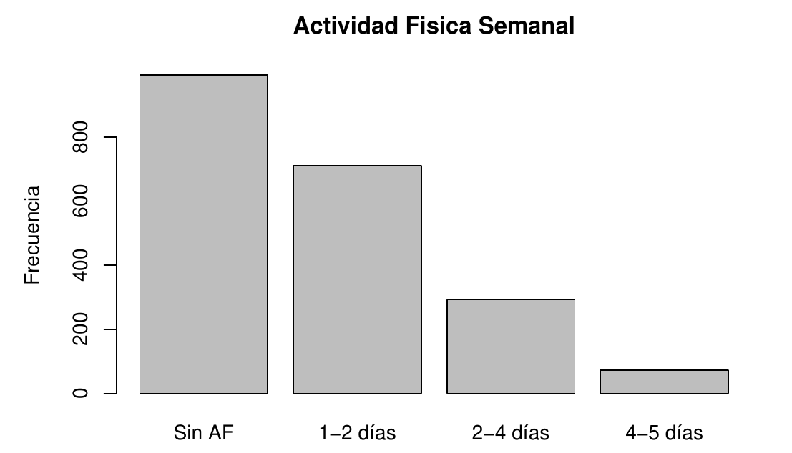
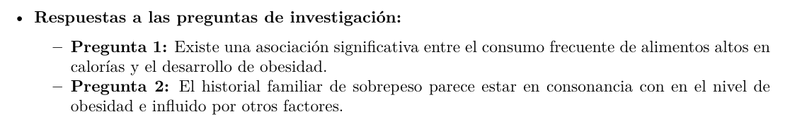
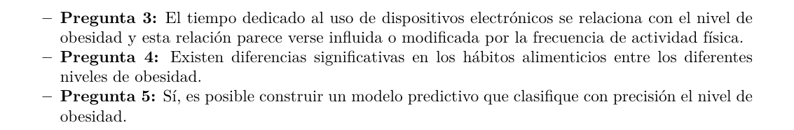

# Obesity Level Classification

## 📄 Project Overview

This project focuses on the analysis and prediction of obesity levels based on lifestyle factors such as eating habits and physical condition. Using a public dataset, this work explores the entire data science workflow: from data cleaning and exploratory data analysis (EDA) to feature engineering and training multiple machine learning models to classify obesity risk.

The primary goal is to identify key predictors of obesity and build an accurate classification model that can determine a person's obesity level, which ranges from "Insufficient Weight" to "Obesity Type III".

## ✨ Key Features

*   **Exploratory Data Analysis (EDA):** In-depth analysis of variables to uncover trends, correlations, and insights between lifestyle habits and obesity.
*   **Data Preprocessing:** Techniques for data cleaning, handling categorical features (e.g., one-hot encoding), and feature scaling to prepare the data for machine learning.
*   **Model Training & Comparison:** Implementation and evaluation of several classification algorithms, such as:
    *   Logistic Regression
    *   K-Nearest Neighbors (KNN)
    *   Support Vector Machines (SVM)
    *   Decision Trees
    *   Random Forest
*   **Performance Evaluation:** Detailed model evaluation using metrics like Accuracy, Precision, Recall, F1-Score, and a Confusion Matrix to select the best-performing model.

## 📊 Dataset

The project uses the "Estimation of Obesity Levels Based on Eating Habits and Physical Condition" dataset from the UCI Machine Learning Repository. This dataset contains 17 attributes and 2,111 records, capturing information about eating habits, physical activity, gender, age, and other lifestyle factors.

- **Source:** [UCI Machine Learning Repository](https://archive.ics.uci.edu/ml/datasets/Estimation+of+obesity+levels+based+on+eating+habits+and+physical+condition+)
- **File:** `ObesityDataSet_raw_and_data_sinthetic.csv`

## 💻 Technologies Used

*   **Language:** Python 3
*   **Libraries:**
    *   Pandas & NumPy (Data Manipulation)
    *   Matplotlib & Seaborn (Data Visualization)
    *   Scikit-learn (Machine Learning)
    *   Jupyter Notebook (Development Environment)

## 🚀 Getting Started

### Prerequisites

*   Python 3.8 or higher
*   Jupyter Notebook or JupyterLab
*   Git

### Installation and Usage

1.  **Clone the repository:**
    ```bash
    git clone https://github.com/Kamaranis/Obesidad_habitos_alimenticios_y_estado_fisico.git
    cd Obesidad_habitos_alimenticios_y_estado_fisico
    ```
2.  **Install dependencies:**
    It's recommended to create a virtual environment first. Then, install the required packages.
    ```bash
    pip install pandas numpy matplotlib seaborn scikit-learn jupyter
    ```
3.  **Launch Jupyter Notebook:**
    ```bash
    jupyter notebook
    ```
4.  **Run the analysis:**
    Open the `.ipynb` file and execute the cells sequentially to see the complete analysis, from data loading to model evaluation.

## 📈 Results Showcase

### 📊 Analysis Showcase & Key Results

This project goes beyond a simple model application, focusing on a rigorous, step-by-step process of data cleaning, exploratory analysis, and predictive modeling. Below are the key highlights from the analysis.

#### 1. In-Depth Data Cleaning and Imputation

A significant part of the project involved addressing missing data. To simulate a real-world scenario, a 5% random data loss was introduced. A tailored, variable-by-variable imputation strategy was then applied, demonstrating a methodical approach to data preparation:

*   **Handling Skewed Data:** For numerical variables with non-normal distributions like `Height` and `Weight`, **median imputation** was chosen over the mean to avoid distortion from outliers.
*   **Advanced Imputation for Complex Relationships:** For categorical variables with significant associations to the target variable (like `family_history_with_overweight`), the **`missForest`** algorithm (based on Random Forest) was used for its high accuracy.
*   **Multiple Imputation for Uncertainty:** For other categorical and ordinal variables (`SMOKE`, `CAEC`, `TUE`), **multiple imputation (mice)** was implemented to account for the uncertainty of the imputed values, using predictive mean matching (`pmm`) and polynomial regression (`polyreg`).

#### 2. Exploratory Data Analysis (EDA) and Hypothesis Testing

Key relationships within the data were identified and statistically validated:

*   **Significant Associations:** Using **Chi-squared tests**, strong statistically significant associations were found between the `NObeyesdad` (obesity level) and lifestyle variables such as family history of overweight, screen time (`TUE`), and eating habits (`CAEC`).
*   **Group Comparisons:** Non-parametric tests like the **Kruskal-Wallis test** confirmed a significant difference in `Weight` across all obesity levels, validating the fundamental structure of the dataset.



#### 3. Predictive Modeling and Performance

A **multinomial logistic regression model** was developed to predict the obesity level based on the cleaned and prepared dataset.

*   **High Predictive Accuracy:** The final model achieved a global accuracy of **87.2%** in classifying individuals into the seven distinct obesity levels.
*   **Detailed Performance Evaluation:** The confusion matrix revealed high precision in predicting categories like `Insufficient_Weight`, `Normal_Weight`, and `Obesity_Type_III`. It also highlighted areas for future improvement, particularly in distinguishing between adjacent categories like `Overweight_Level_I` and `Overweight_Level_II`.

**Model Performance Summary:**

| Metric | Value |
| :--- | :---: |
| **Global Accuracy** | **87.2%** |
| **Target Variable** | NObeyesdad (7 classes) |
| **Model Type**| Multinomial Logistic Regression |




## 👤 Author

**Antonio Barrera Mora**

*   **LinkedIn:** https://www.linkedin.com/in/anbamo/
*   **GitHub:** @Kamaranis